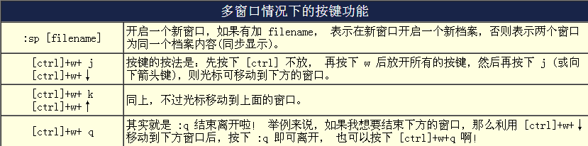
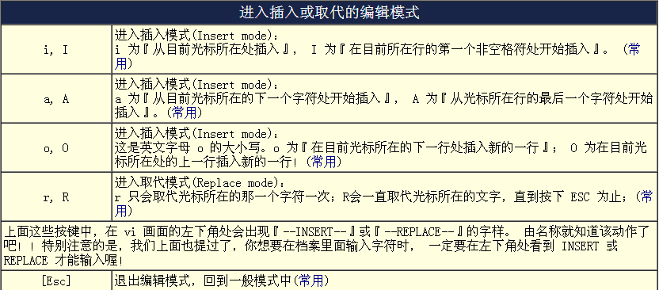
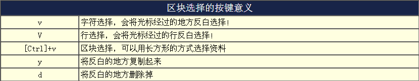
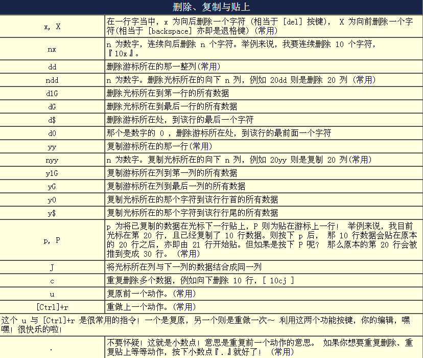
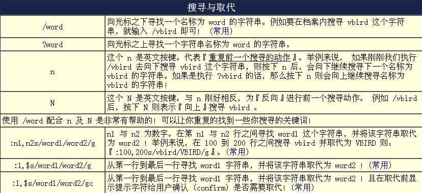
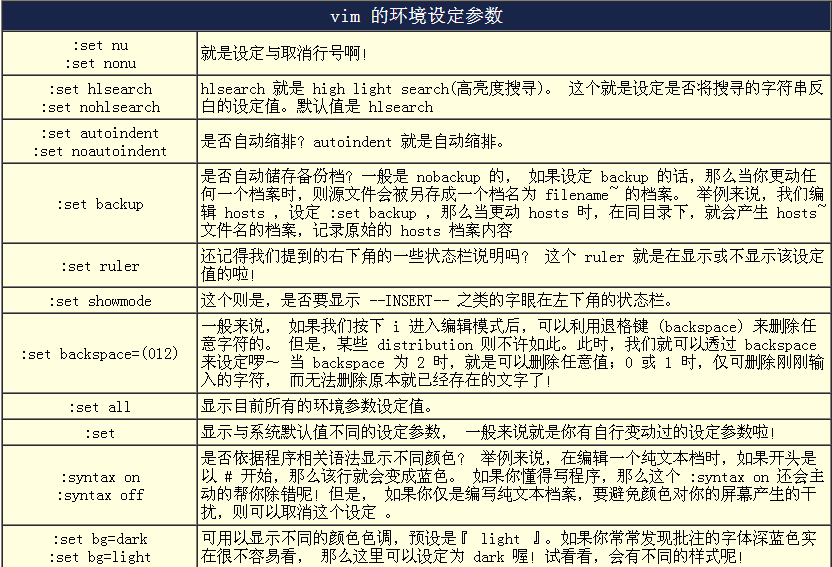
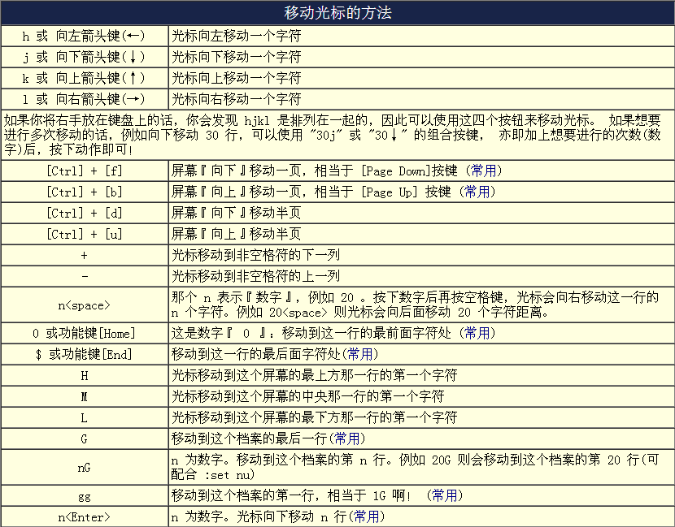
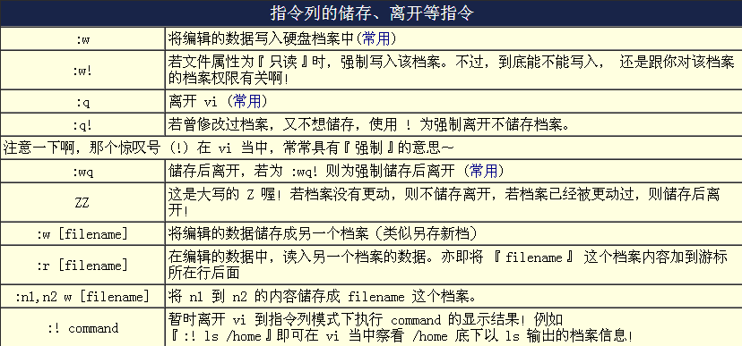

Vim
===

配置
----

vim ~/.vimrc

.. code-block:: bash

    # 设置行号
    set nu
    
    # tab宽度4个空格
    set tabstop=4
    
    # tab转换为4个空格
    set expandtab
    
    # 自动缩进
    set autoindent
    
    #设置默认编码
    set encoding=utf-8

命令
----

